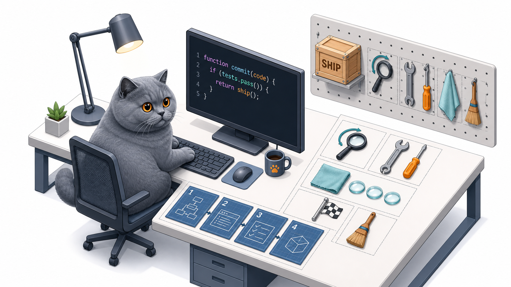

# tgc-skills

<p align="center">
  
</p>

A shipping pipeline for [Claude Code](https://docs.anthropic.com/en/docs/claude-code),
packaged as a plugin. Nine skills that take a change from "locked plan" to "merged and
cleaned up", using in-session agents and the authenticated GitHub user (the two cmux
pane-orchestration skills additionally use the optional cmux terminal).

## The pipeline

```
orchestrate ──► checkpoint ──► ship ──► review-loop ──► (you merge) ──► merged
     │                           │            │
orchestrate-plan               polish     review-fix
(cmux variant)
```

| Skill | What it does |
|---|---|
| **orchestrate** | Execute a locked plan too big for one context window: split it into phases, dispatch one fresh subagent per phase, verify each with git plumbing, run independent repos as parallel lanes. |
| **orchestrate-plan** | The cmux variant of orchestrate: drive visible worker agents in separate terminal panes, `/clear` each worker between phases, and babysit parallel lanes with a monitor/unblock loop. Requires a cmux workspace; falls back to orchestrate elsewhere. |
| **cmux-orchestrate** | The cmux control layer the variant builds on: verified CLI cheat sheet for pane layouts, sending work to workers, reading screens, and answering agent prompts in other panes. |
| **ship** | The pre-merge pipeline: polish the diff, run the repo's reproducible local gate, commit, push, open a PR, hand it to the review loop. Never merges. |
| **review-loop** | Review → fix → re-review with independent agent reviewers until clean (max 5 iterations). Commits locally each round and pushes once; clean exits are squashed. |
| **review-fix** | One pass of the fix cycle: gather every page of PR findings, fix them, commit, gate the committed branch and merge tree, push. |
| **polish** | Three parallel review lenses (correctness, simplification, over-engineering) over the current diff; auto-applies only safe, behavior-preserving findings. |
| **checkpoint** | Mid-flow quick save: cheap verify, one commit, push, keep going. |
| **merged** | Post-merge tail: verify the merge, check that DB migrations actually ran, answer the deploy question, safely clean this PR's branch/worktree, optional release. |

Design principles baked in:

- **One phase per context window.** Fresh subagents re-ground from disk instead of
  inheriting lossy summaries.
- **The orchestrator keeps implementation detail out of its context** — verification is
  git plumbing, narrow greps, and focused read-only agents.
- **Merging is always the human's move.** No skill in this repo ever merges a PR.
- **Local gates are reported honestly.** Skills run documented/pre-push commands against
  the working branch and merge tree. They do not pretend local shell commands reproduce
  hosted actions, service containers, matrices, or external checks.
- **Temporary artifacts stay outside repos.** Worker briefs and loop status files use
  unique paths under the system temporary directory and clean up after themselves.

## Usage and safety

Plugin skills are namespaced. For example:

```text
/tgc-skills:orchestrate PLAN.md
/tgc-skills:checkpoint
/tgc-skills:ship
/tgc-skills:review-fix 123
/tgc-skills:merged 123
```

`orchestrate`, `checkpoint`, `ship`, `review-fix`, and `merged` require explicit slash
invocation. `polish` and `review-loop` remain composable by the pipeline, but proceed
only after an explicit request or invocation by an active parent workflow. No skill
merges a PR or force-pushes.

## Install

```
/plugin marketplace add EternallLight/tgc-skills
/plugin install tgc-skills@tgc-skills
```

## Requirements

- Claude Code 2.1.172 or newer — the review workflow relies on nested subagents, which
  landed in that release.
- A Unix-like shell with standard utilities, including `mktemp`.
- `git` and the [GitHub CLI](https://cli.github.com/) (`gh`), authenticated.
- Optional: the cmux terminal for `orchestrate-plan` and `cmux-orchestrate` —
  everything else runs with in-session agents only.

This plugin targets GitHub repositories. Hosted CI and external checks remain
authoritative when a repository does not expose a reproducible local gate. Pushes and PR
comments come from your authenticated GitHub user.

## License

MIT
